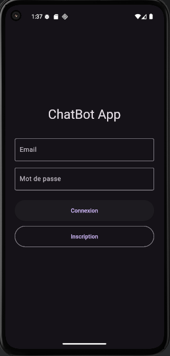
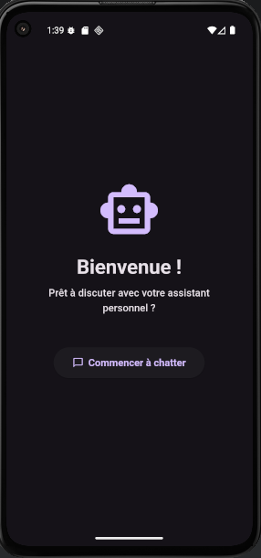
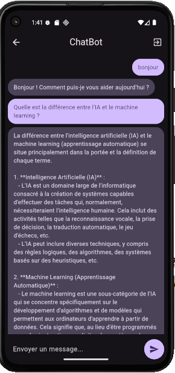

## chatbot Flutter Application

# Écran d'Authentification
Cet écran est la porte d'entrée sécurisée de l'application. Il gère l'accès des utilisateurs.

- **Inscription** : Permet à un nouvel utilisateur de créer un compte en fournissant une adresse e-mail et un mot de passe. Ces informations sont ensuite enregistrées de manière sécurisée (mot de passe haché) dans la base de données locale SQLite.
- **Connexion** : Un utilisateur existant peut se connecter en utilisant ses identifiants. L'application vérifie la correspondance dans la base de données avant d'autoriser l'accès.

---

## Page d'Accueil 

Cette page sert d'accueil chaleureux après une connexion réussie.

- **Confirmation** : Elle confirme à l'utilisateur que son authentification a réussi.
- **Navigation** : Son rôle principal est de servir de point de transition. Le bouton "Commencer à chatter" permet à l'utilisateur de naviguer de manière intuitive vers l'écran principal de l'application : le chatbot.

---

## Interface de Chat 

C'est l'écran principal et le cœur fonctionnel de l'application.

- **Interaction en temps réel** : L'utilisateur peut écrire un message dans le champ de texte en bas et l'envoyer à l'IA en cliquant sur l'icône d'envoi.
- **Historique de conversation** : L'écran affiche l'échange complet entre l'utilisateur (en violet) et le chatbot (en gris), en maintenant le contexte de la discussion pour des réponses cohérentes.
- **Intégration de l'API** : Chaque message envoyé par l'utilisateur est transmis à l'API OpenAI, et la réponse de l'IA est ensuite affichée à l'écran.
- **Déconnexion** : L'icône en haut à droite permet à l'utilisateur de se déconnecter et de retourner en toute sécurité à l'écran d'authentification.
